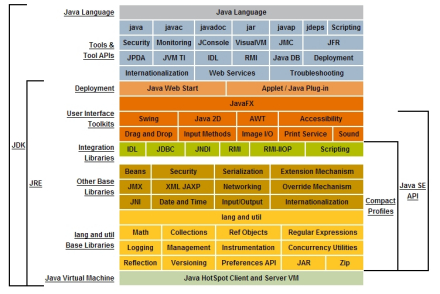

# Java-in-action简介

本项目是一个可以帮助程序员快速系统地梳理Java基础知识的教学项目,本项目参照了市面上比较流行的教材如: 《Java核心技术》,《Java并发编程的艺术》,《Java编程思想》等,系统全面地介绍了Java的基础概念以及高级特性,言简意赅,可以快速地复习应对面试.项目中每一个模块都对应着Java的一些基础知识点,对应的Markdown文档都在根目录的doc文件夹内,这个md文件详细地介绍了对应的知识点.

而且,以后本项目对应的Markdown文档还会持续更新,以后很多东西都会根据作者的技术感悟,技术理解进行更新.

# 一. Java语言简介

Java是一门面向对象的编程语言，不仅吸收了C++语言的各种优点，还摒弃了C++里难以理解的**多继承、指针**等概念，因此Java语言具有功能强大和简单易用两个特征。Java语言作为静态面向对象编程语言的代表，极好地实现了面向对象理论，允许程序员以优雅的思维方式进行复杂的编程 。

Java具有简单性、面向对象、分布式、健壮性、安全性、平台独立与可移植性、多线程、动态性等特点 [2] 。Java可以编写桌面应用程序、Web应用程序、分布式系统和嵌入式系统应用程序等  。

# 二. 发展历程

20世纪90年代，硬件领域出现了单片式计算机系统，这种价格低廉的系统一出现就立即引起了自动控制领域人员的注意，因为使用它可以大幅度提升消费类电子产品*（如电视机顶盒、面包烤箱、移动电话等）*的智能化程度。Sun公司为了抢占市场先机，在1991年成立了一个称为Green的项目小组，帕特里克、詹姆斯·高斯林、麦克·舍林丹和其他几个工程师一起组成的工作小组在加利福尼亚州门洛帕克市沙丘路的一个小工作室里面研究开发新技术，专攻计算机在家电产品上的嵌入式应用。

由于C++所具有的优势，该项目组的研究人员首先考虑采用C++来编写程序。但对于硬件资源极其匮乏的单片式系统来说，C++程序过于复杂和庞大。另外由于消费电子产品所采用的嵌入式处理器芯片的种类繁杂，如何让编写的程序跨平台运行也是个难题。为了解决困难，他们首先着眼于语言的开发，假设了一种结构简单、符合嵌入式应用需要的硬件平台体系结构并为其制定了相应的规范，其中就定义了这种硬件平台的二进制机器码指令系统*（即后来成为“**字节码**”的指令系统）*，以待语言开发成功后，能有半导体芯片生产商开发和生产这种硬件平台。对于新语言的设计，Sun公司研发人员并没有开发一种全新的语言，而是根据嵌入式软件的要求，对C++进行了改造，去除了留在C++的一些不太实用及影响安全的成分，并结合嵌入式系统的实时性要求，开发了一种称为Oak的面向对象语言。

由于在开发Oak语言时，尚且不存在运行字节码的硬件平台，所以为了在开发时可以对这种语言进行实验研究，他们就在已有的硬件和软件平台基础上，按照自己所指定的规范，用软件建设了一个运行平台，整个系统除了比C++更加简单之外，没有什么大的区别。1992年的夏天，当Oak语言开发成功后，研究者们向硬件生产商进行演示了Green操作系统、Oak的程序设计语言、类库和其硬件，以说服他们使用Oak语言生产硬件芯片，但是，硬件生产商并未对此产生极大的热情。因为他们认为，在所有人对Oak语言还一无所知的情况下，就生产硬件产品的风险实在太大了，所以Oak语言也就因为缺乏硬件的支持而无法进入市场，从而被搁置了下来。

1994年6、7月间，在经历了一场历时三天的讨论之后，团队决定再一次改变了努力的目标，这次他们决定将该技术应用于万维网。他们认为随着Mosaic浏览器的到来，因特网正在向同样的高度互动的远景演变，而这一远景正是他们在有线电视网中看到的。作为原型，帕特里克·诺顿写了一个小型万维网浏览器WebRunner。 [8] 

1995年，互联网的蓬勃发展给了Oak机会。业界为了使死板、单调的静态网页能够“灵活”起来，急需一种软件技术来开发一种程序，这种程序可以通过网络传播并且能够跨平台运行。于是，世界各大IT企业为此纷纷投入了大量的人力、物力和财力。这个时候，Sun公司想起了那个被搁置起来很久的Oak，并且重新审视了那个用软件编写的试验平台，由于它是按照嵌入式系统硬件平台体系结构进行编写的，所以非常小，特别适用于网络上的传输系统，而Oak也是一种精简的语言，程序非常小，适合在网络上传输。Sun公司首先推出了可以嵌入网页并且可以随同网页在网络上传输的Applet*（Applet是一种将小程序嵌入到网页中进行执行的技术）*，并将Oak更名为Java*（在申请注册商标时，发现Oak已经被人使用了，再想了一系列名字之后，最终，使用了提议者在喝一杯Java咖啡时无意提到的Java词语）*。5月23日，Sun公司在Sun world会议上正式发布Java和HotJava浏览器。IBM、Apple、DEC、Adobe、HP、Oracle、Netscap**e**和微软等各大公司都纷纷停止了自己的相关开发项目，竞相购买了Java使用许可证，并为自己的产品开发了相应的Java平台。 [9-10] 

1996年1月，Sun公司发布了Java的第一个开发工具包*（JDK 1.0）*，这是Java发展历程中的重要里程碑，标志着Java成为一种独立的开发工具。9月，约8.3万个网页应用了Java技术来制作。10月，Sun公司发布了Java平台的第一个即时*（JIT）*编译器。

1997年2月，JDK 1.1面世，在随后的3周时间里，达到了22万次的下载量。4月2日，Java One会议召开，参会者逾一万人，创当时全球同类会议规模之纪录。9月，Java Developer Connection社区成员超过10万。

1998年12月8日，第二代Java平台的企业版J2EE发布。1999年6月，Sun公司发布了第二代Java平台（简称为Java2）的3个版本：J2ME（Java2 Micro Edition，Java2平台的微型版），应用于移动、无线及有限资源的环境；J2SE（Java 2 Standard Edition，Java 2平台的标准版），应用于桌面环境；J2EE（Java 2Enterprise Edition，Java 2平台的企业版），应用于基于Java的应用服务器。Java 2平台的发布，是Java发展过程中最重要的一个里程碑，标志着Java的应用开始普及。

1999年4月27日，HotSpot虚拟机发布。HotSpot虚拟机发布时是作为JDK 1.2的附加程序提供的，后来它成为了JDK 1.3及之后所有版本的Sun JDK的默认虚拟机 [11] 。

Java创始人之一：詹姆斯·高斯林

2000年5月，JDK1.3、JDK1.4和J2SE1.3相继发布，几周后其获得了Apple公司Mac OS X的工业标准的支持。2001年9月24日，J2EE1.3发布。2002年2月26日，J2SE1.4发布。自此Java的计算能力有了大幅提升，与J2SE1.3相比，其多了近62%的类和接口。在这些新特性当中，还提供了广泛的XML支持、安全套接字*（Socket）*支持*（通过SSL与TLS协议）*、全新的I/OAPI、正则表达式、日志与断言。2004年9月30日，J2SE1.5发布，成为Java语言发展史上的又一里程碑。为了表示该版本的重要性，J2SE 1.5更名为Java SE 5.0*（内部版本号1.5.0）*，代号为“Tiger”，Tiger包含了从1996年发布1.0版本以来的最重大的更新，其中包括泛型支持、基本类型的自动装箱、改进的循环、枚举类型、格式化I/O及可变参数。

2005年6月，在Java One大会上，Sun公司发布了Java SE 6。此时，Java的各种版本已经更名，已取消其中的数字2，如J2EE更名为JavaEE，J2SE更名为JavaSE，J2ME更名为JavaME。 [12] 

2006年11月13日，Java技术的发明者Sun公司宣布，将Java技术作为免费软件对外发布。Sun公司正式发布的有关Java平台标准版的第一批源代码，以及Java迷你版的可执行源代码。从2007年3月起，全世界所有的开发人员均可对Java源代码进行修改 [13] 。

2009年，甲骨文公司宣布收购Sun [14] 。

2010年，Java编程语言的共同创始人之一詹姆斯·高斯林从Oracle公司辞职。2011年，甲骨文公司举行了全球性的活动，以庆祝Java7的推出，随后Java7正式发布。

2014年，甲骨文公司发布了Java8正式版 [15] 。

2017 年 9 月 22 日，Java 9正式发布，带来了很多新特性，其中最主要的变化是已经实现的模块化系统。 [57] 

# 三. 编程环境

Java概念图 

JDK*（Java Development Kit）*称为Java开发包或Java开发工具，是一个编写Java的Applet小程序和应用程序的程序开发环境。JDK是整个Java的核心，包括了Java运行环境*（Java Runtime Environment）*，一些Java工具和Java的核心类库*（Java API）*。不论什么Java应用服务器实质都是内置了某个版本的JDK。主流的JDK是Sun公司发布的JDK，除了Sun之外，还有很多公司和组织都开发了自己的JDK，例如，IBM公司开发的JDK，BEA公司的Jrocket，还有GNU组织开发的JDK  。

另外，可以把Java API类库中的Java SE API子集和Java虚拟机这两部分统称为JRE*（JAVA Runtime Environment）*，JRE是支持Java程序运行的标准环境  。

JRE是个运行环境，JDK是个开发环境。因此写Java程序的时候需要JDK，而运行Java程序的时候就需要JRE。而JDK里面已经包含了JRE，因此只要安装了JDK，就可以编辑Java程序，也可以正常运行Java程序。但由于JDK包含了许多与运行无关的内容，占用的空间较大，因此运行普通的Java程序无须安装JDK，而只需要安装JRE即可 。

编程工具:

- Eclipse：一个开放源代码的、基于Java的可扩展开发平台 .
- NetBeans：开放源码的Java集成开发环境，适用于各种客户机和Web应用.
- IntelliJ IDEA：在代码自动提示、代码分析等方面的具有很好的功能. 
- MyEclipse：由Genuitec公司开发的一款商业化软件，是应用比较广泛的Java应用程序集成开发环境 .
- EditPlus：如果正确配置Java的编译器“Javac”以及解释器“Java”后，可直接使用EditPlus编译执行Java程序.
